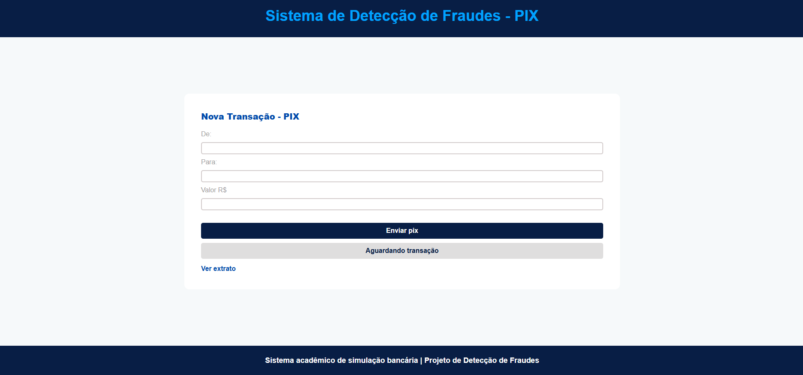
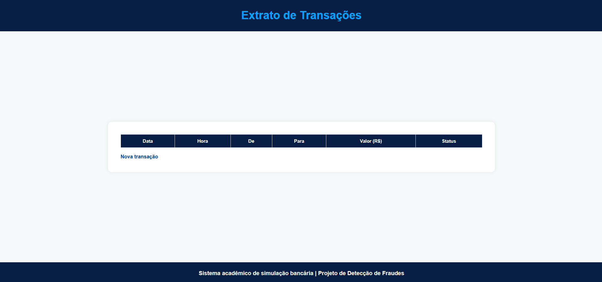
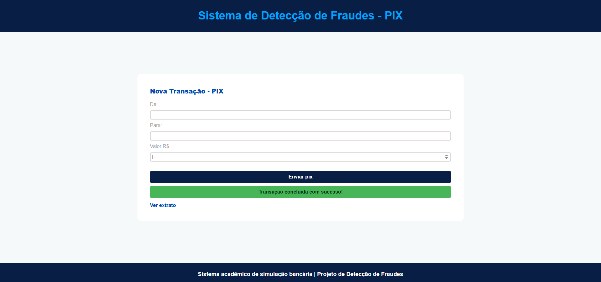
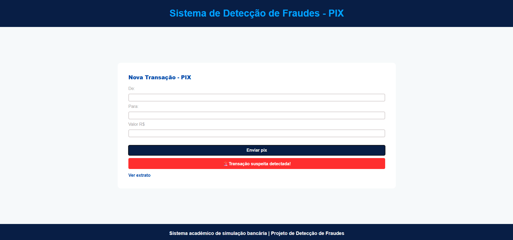
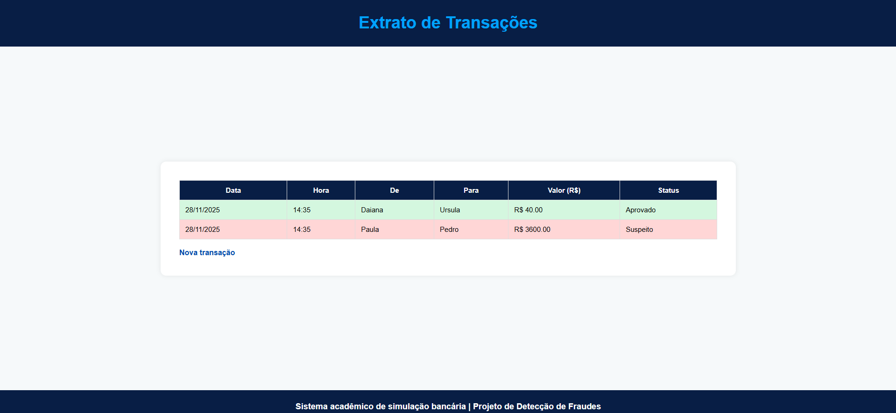

# 🏦 Mini Banking System

Um mini sistema bancário simulado desenvolvido para fins acadêmicos, com funcionalidades básicas como página de PIX, extrato, simulação de transações e interface simples em HTML, CSS e JavaScript.

Deploy: [Simulated Mini Banking](https://amandaadev.github.io/Simulated-mini-banking-system/index.html)

## 📌 **Sobre o Projeto**

Este projeto foi construído como uma atividade prática para simular o funcionamento básico de transações bancárias.
Ele contém:

- Tela de PIX com botões de envio e simulação de status
- Tela de extrato com listagem das transações realizadas
- Lógica em JavaScript para alteração de estados (sucesso/suspeita/aguardando)
- Estrutura simples em HTML e CSS

## ✨ **Funcionalidades**

### ✔️ **Página de PIX**

- Botão que simula envio de transação
- Alternância de status entre:

  - Aguardando transação
  - Transação realizada
  - Transação suspeita

- Status volta automaticamente para "Aguardando transação" após 3 segundos

### ✔️ **Página de Extrato**

- Lista todas as transações simuladas
- Exibe data, tipo e situação da transação
- Estrutura clara e simples de visualizar

## 🛠 **Tecnologias Utilizadas**

- **HTML5**
- **CSS3**
- **JavaScript**

## 📂 **Status das transações**

### Cenário em que a transação é concluída:

### Cenário em que a transação é considerada suspeita:

### Histórico de todas as transações realizadas, incluindo operações aprovadas e marcadas como suspeitas.

